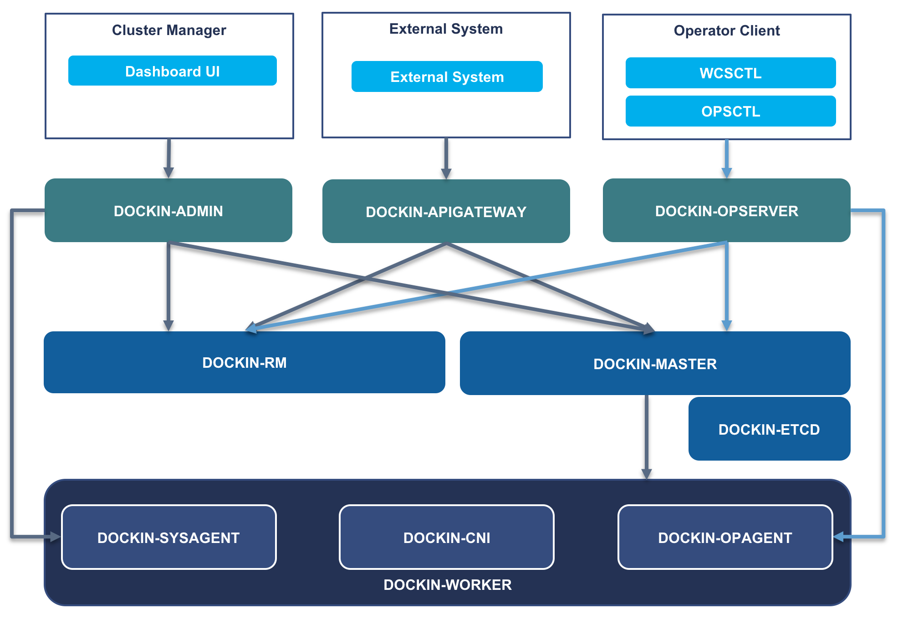

# Dockin CNI - Dockin Container Network Interface
[](https://www.apache.org/licenses/LICENSE-2.0.html)

English | [中文](README.zh-CN.md)

Dockin operation and maintenance management system is a safe operation and maintenance management service that optimizes exec execution performance and supports command authority management

**For more Dockin components, please visit [https://github.com/WeBankFinTech/Dockin](https://github.com/WeBankFinTech/Dockin)**




## **Dockin cni**
dockin cni used to manager pod network, interact with resource manager(RM), support:
- create single network
- create multiple network
- only support dockin-ipam ipam plugin
- only support bridge to manage network

dockin cni must work with
- dockin-cni, main plugin, used to call bridge to manage network, and communicate with rm
- dockin-ipam, used to assign ip
- bridge, used to manage network


## Quick Start

### 1. cni configuration
You should put cni config file to `/etc/cni/net.d` (Default config path using by kubelet. If you redirect the config path, put the config to the path that your kubelet using).

The name of config file name can named like `00-dockin-cni.json`.

configuration sample:
```
{
    "cniVersion": "0.2.0",
    "name": "dockin-cni",
    "type": "dockin-cni",
    "confDir": "/etc/cni/dockin/net.d",
    "binDir": "/opt/cni/bin",
    "logFile": "/data/kubernetes/dockin-cni.log",
    "logLevel": "debug",
    "backend": "http://localhost:10002/rmController/getPodMultiNetwork"
}
```
all the parameters a described as follows:
- cniVersion, support version
- name, the name about this cni plugin
- type, binary execution file, always be dockin-cni
- confDir, the dir about network configuration
- binDir, the binary execution about bridge
- logFile, file to store the dockin-cni's log
- logLevel, log level, support error/info/debug
- backend, the api address of webhook, here using the api of dockin-RM as the sample.


### 2. Network configuration

We need to create network config file as well. 

#### Step1: Using webhook to get network type.
Firstly, you should have a web server（webhook） to get the pod (multi)network information, and implement an API with `podName` query parameter:
```
<IP>:<port>/<URL>?podName=
```

Here we using Dockin-RM as the sample. You can use `curl` to access RM, for example:
```
curl 127.0.0.1:10002/rmController/getPodMultiNetwork?podName=<your_pod_name>
```
If there is no error, you will get response like this. You web API must return a struct as below as well.
```
{
    "code": 0,
    "reqId": "1234",
    "message": "success",
    "data": [
        {
            "type": "test",
            "podIp": "192.168.1.2",
            "subnetMask": "255.255.255.0",
            "gateway": "192.168.1.1",
            "ifName": "eth0",
            "master": true
        },
        {
            "type": "dockin",
            "podIp": "192.168.2.2",
            "subnetMask": "255.255.255.0",
            "gateway": "192.168.1.1",
            "ifName": "net0",
            "master": false
        }
    ]
}
```
in the sample:
- code, indicates the response code, 0 means success, otherwise failed
- message, indicates the description about this response, success or failed message
- data, is the array about network information
    - type, network type, 
    - podIp, the ip which will assign to this network
    - subnetMask, mask about this network
    - gateway, the gateway about this network
    - ifName, the network device name about this network, which will show in ifconfig or ip a
    - master, weather the main network, which will show in kubectl get pods, and this must be single in a pod
    
**What we need to pay attention to is the field `type`. In the sample, there is two types: `test` and `dockin`**

#### Step2: create network config file.

network configuration is the bridge configuration, for more details:
>https://github.com/containernetworking/plugins/tree/master/plugins/main/bridge

network configuration are json files which stored in `confDir` set in the cni configuration.
and will pass to kubelet create network.

```
{
  "cniVersion": "0.2.0",
  "name": "dockin",
  "type": "bridge",
  "bridge": "br1"
}
``` 

- cniVersion, indicate the version support in this cni
- name, the network name, must be same with the rm type
- type, only support bridge to manage network
- bridge, the bridge name about this network, multiple network can assign different bridge name

**Now, let's start to create network config.**

- Firstly, create config dir:

You can find the path in the `00-dockin-cni.json`
```shell
mkdir -p /etc/cni/dockin/net.d  
```

- Secondly,create config file:

In the sample as above, we need to create two network config file.

1.create config for type `test`：

```
touch /etc/cni/dockin/net.d/test.json
```
content：
```JSON
{
  "cniVersion": "0.2.0",
  "name": "test", // type
  "type": "bridge",
  "bridge": "br0"
}
```

2.create config for type `dockin`：

```
touch /etc/cni/dockin/net.d/dockin.json
```
content：
```JSON
{
  "cniVersion": "0.2.0",
  "name": "dockin", // type
  "type": "bridge",
  "bridge": "br0"
}
```

### 3. Put executable binary to `binDir`

You can using `make` to build `dockin-cni` and `dockin-ipam`. Then put them to `binDir` in the `00-dockin-cni.json`. The binDir is `/opt/cni/bin` normally.

## **Dockin-ipam**: static IP address management plugin

### Overview

static IPAM is very simple IPAM plugin that assigns IPv4 and IPv6 addresses statically to container. This will be useful in case of assign same IP address in different vlan/vxlan to containers.


### Example configuration

```
{
	"ipam": {
		"type": "static",
		"addresses": [
			{
				"address": "192.168.0.1/24",
				"gateway": "192.168.0.254"
			},
			{
				"address": "3ffe:ffff:0:01ff::1/64",
				"gateway": "3ffe:ffff:0::1"
			}
		],
		"routes": [
			{ "dst": "0.0.0.0/0" },
			{ "dst": "192.168.0.0/16", "gw": "192.168.1.1" },
			{ "dst": "3ffe:ffff:0:01ff::1/64" }
		],
		"dns": {
			"nameservers" : ["8.8.8.8"],
			"domain": "example.com",
			"search": [ "example.com" ]
		}
	}
}
```

### Network configuration reference

* `type` (string, required): "static"
* `addresses` (array, optional): an array of ip address objects:
	* `address` (string, required): CIDR notation IP address.
	* `gateway` (string, optional): IP inside of "subnet" to designate as the gateway.
* `routes` (string, optional): list of routes add to the container namespace. Each route is a dictionary with "dst" and optional "gw" fields. If "gw" is omitted, value of "gateway" will be used.
* `dns` (string, optional): the dictionary with "nameservers", "domain" and "search".

### Supported arguments

The following [CNI_ARGS](https://github.com/containernetworking/cni/blob/master/SPEC.md#parameters) are supported:

* `IP`: request a specific CIDR notation IP addresses, comma separated
* `GATEWAY`: request a specific gateway address

    (example: CNI_ARGS="IP=192.168.1.1/24;GATEWAY=192.168.1.254")

The plugin also support following [capability argument](https://github.com/containernetworking/cni/blob/master/CONVENTIONS.md).

* `ips`: Pass IP addresses for CNI interface

The following [args conventions](https://github.com/containernetworking/cni/blob/master/CONVENTIONS.md#args-in-network-config) are supported:

* `ips` (array of strings): A list of custom IPs to attempt to allocate, with prefix (e.g. '192.168.1.1/24')

Notice: If some of above are used at same time, only one will work according to the priorities below

1. [capability argument](https://github.com/containernetworking/cni/blob/master/CONVENTIONS.md)
1. [args conventions](https://github.com/containernetworking/cni/blob/master/CONVENTIONS.md#args-in-network-config)
1. [CNI_ARGS](https://github.com/containernetworking/cni/blob/master/SPEC.md#parameters)
